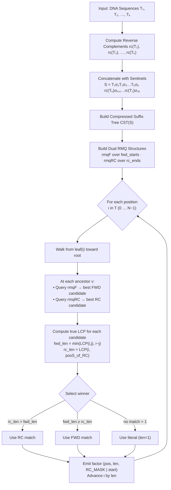
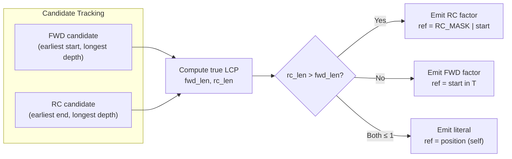

# Reverse-Complement Aware noLZSS Factorization

## Introduction

The noLZSS library implements the non-overlapping Lempel-Ziv-Storer-Szymanski (LZSS) factorization algorithm based on the pseudocode published by Köppl (2021) in ["Non-Overlapping LZ77 Factorization and LZ78 Substring Compression Queries with Suffix Trees"](https://doi.org/10.3390/a14020044). This document describes the **reverse-complement (RC) aware extension** we added to support genomic DNA analysis, where the complementary strand of DNA carries biologically equivalent information.

### Why Reverse-Complement Awareness?

In molecular biology, DNA is double-stranded. Each strand is the reverse complement of the other:
- `A` pairs with `T`, and `C` pairs with `G`
- The strand `5'-ATCG-3'` has the reverse complement `5'-CGAT-3'`

A motif appearing on the forward strand at one position may reappear as a reverse complement at another position. Standard text-factorization algorithms only find forward (same-strand) matches and miss these biologically meaningful repetitions. By extending the algorithm to also search for reverse-complement matches, we can capture a more complete picture of the repetitive structure of a genome.

## Base Algorithm Recap

The base noLZSS algorithm (Algorithm 1 in Köppl, 2021) factorizes a text `T[0..n-1]` into non-overlapping factors using a compressed suffix tree (CST). For each position `i`, it finds the longest previous non-overlapping occurrence — i.e., the longest substring `T[i..i+ℓ-1]` that also appears starting at some position `j < i` such that `j + ℓ - 1 < i` (non-overlap constraint). If no such occurrence exists, a literal factor of length 1 is emitted.

```
Base-noLZSS(T):
  Build CST over T
  Build RMQ over suffix array (minimum suffix start positions)
  i ← 0
  while i < |T|:
    Walk from leaf(i) toward root, tracking the ancestor v
      whose subtree contains a suffix starting at position j
      with j + depth(v) - 1 < i  (non-overlap)
    Compute ℓ = min(LCP(i, j), i - j)
    Emit factor (position=i, length=ℓ, reference=j)
    i ← i + ℓ
```

## RC-Aware Extension

### Overview

The RC-aware algorithm extends the base algorithm in three key ways:

1. **String Construction**: Concatenates the original sequences with their reverse complements, separated by unique sentinel characters, into a single string `S`.
2. **Dual RMQ Structures**: Maintains two independent range-minimum-query structures — one for forward matches and one for RC matches — each with a different non-overlap criterion.
3. **Independent Candidate Tracking**: During the tree walk, tracks the best forward and best RC candidate independently, then selects the winner based on true LCP lengths.

### Phase 1: String Preparation

Given `k` DNA sequences `T₁, T₂, …, Tₖ`, the prepared string `S` is constructed as:

```
S = T₁ σ₁ T₂ σ₂ … Tₖ σₖ rc(Tₖ) σₖ₊₁ rc(Tₖ₋₁) σₖ₊₂ … rc(T₁) σ₂ₖ
```

where:
- `rc(Tᵢ)` is the reverse complement of sequence `Tᵢ`
- `σ₁, σ₂, …, σ₂ₖ` are unique sentinel characters (bytes 1–251, avoiding `A`, `C`, `G`, `T`, and `\0`)
- Reverse complements are appended in **reverse order** of the original sequences

#### Example with Two Sequences

```
Original sequences:  T₁ = ATCG,  T₂ = GCTA

Reverse complements: rc(T₁) = CGAT,  rc(T₂) = TAGC

Prepared string S (2k = 4 sentinels for k = 2 sequences):

  Position: 0 1 2 3 4 5 6 7 8 9 10 11 12 13 14 15 16 17 18
  Content:  A T C G σ₁ G C T A σ₂ T  A  G  C  σ₃ C  G  A  T  σ₄
            |---------|  |---------|  |----------|  |----------|
            T₁          T₂          rc(T₂)        rc(T₁)

         ←———— N = 10 ————→←——————— N + 1 ... ———————————————→
         Original part (T)          Reverse complement part (R)
```

The **original part** `T = S[0..N-1]` contains the concatenated forward sequences (with their sentinels). The **RC part** `R = S[N+1..2N]` contains the reverse complements. A sentinel at position `N` separates the two halves. The total length of `S` is `2N + 2` (including the final sentinel).

### Phase 2: Dual RMQ Construction

After building the CST over `S`, two auxiliary arrays are constructed, both indexed by suffix-array rank:

| Array | Contents | Purpose |
|---|---|---|
| `fwd_starts[k]` | Start position in `T` if suffix `SA[k]` begins in the original part; `∞` otherwise | Find the earliest-starting forward match |
| `rc_ends[k]` | Mapped end position in `T` if suffix `SA[k]` begins in the RC part; `∞` otherwise | Find the earliest-ending RC match |

**RC coordinate mapping**: A suffix starting at position `posS` in the RC part `R` maps to a **end position** in `T` as:

```
jR    = posS - (N + 1)       // 0-based offset within R
endT  = N - jR - 1           // corresponding end position in T (0-based)
```

This mapping works because `R` is constructed by reversing and complementing each sequence; position `jR` in `R` corresponds to position `N - jR - 1` in the original text when read in the opposite direction.

Two RMQ structures are built:
- `rmqF` over `fwd_starts` — answers "which suffix in this SA range has the smallest start in `T`?"
- `rmqRC` over `rc_ends` — answers "which suffix in this SA range has the smallest end in `T`?"

### Phase 3: RC-Aware Factorization

The factorization loop processes each position `i` in the original text `T[0..N-1]`:

```
RC-noLZSS(S, start_pos):
  Build CST over S
  N ← (|S| / 2) - 1                          // length of original part
  Compute fwd_starts[] and rc_ends[] arrays
  Build rmqF over fwd_starts, rmqRC over rc_ends

  λ ← leaf of suffix S[start_pos..]
  i ← start_pos

  while i < N:
    ─── Step A: Walk up the tree, tracking candidates ───
    best_fwd ← ∅                              // (start, depth) for forward
    best_rc  ← ∅                              // (end, posS, depth) for RC

    for step = 1, 2, … up to node_depth(λ):
      v ← level_ancestor(λ, step)
      ℓ ← string_depth(v)
      if ℓ = 0: break                         // reached root

      // Forward candidate
      kF ← rmqF(lb(v), rb(v))
      jF ← fwd_starts[kF]
      okF ← (jF ≠ ∞) and (jF + ℓ - 1 < i)   // non-overlap check

      // RC candidate
      kR ← rmqRC(lb(v), rb(v))
      endRC ← rc_ends[kR]
      okR ← (endRC ≠ ∞) and (endRC < i)       // non-overlap check

      if not okF and not okR:
        break                                  // monotonicity: no deeper
                                               // node can satisfy either

      if okF and (ℓ > best_fwd.depth
                  or (ℓ = best_fwd.depth and jF earlier)):
        best_fwd ← (start=jF, depth=ℓ)

      if okR and (ℓ > best_rc.depth
                  or (ℓ = best_rc.depth and endRC earlier)):
        best_rc ← (end=endRC, posS=SA[kR], depth=ℓ)

    ─── Step B: Compute TRUE match lengths ───
    if best_fwd ≠ ∅:
      fwd_len ← min(LCP(i, best_fwd.start), i - best_fwd.start)
    if best_rc ≠ ∅:
      rc_len ← LCP(i, best_rc.posS)

    ─── Step C: Select winner ───
    if best_fwd ≠ ∅ and fwd_len ≥ 1:
      if best_rc ≠ ∅ and rc_len > fwd_len:
        use RC match                           // RC strictly longer
      else:
        use forward match                      // forward wins (incl. ties)
    else if best_rc ≠ ∅ and rc_len > 1:
      use RC match                             // RC strictly > literal
    else:
      use literal (length=1, ref=i)            // self-reference

    ─── Step D: Emit factor and advance ───
    if using forward:
      emit (i, fwd_len, best_fwd.start)
      advance i by fwd_len
    else if using RC:
      rc_start ← best_rc.end - rc_len + 1
      emit (i, rc_len, RC_MASK | rc_start)     // MSB flags RC match
      advance i by rc_len
    else:
      emit (i, 1, i)                           // literal
      advance i by 1
```

### RC Encoding in Output Factors

Each emitted factor is a triple `(position, length, reference)`:

| Field | Forward match | RC match | Literal |
|---|---|---|---|
| `position` | Start in `T` | Start in `T` | Start in `T` |
| `length` | Match length `ℓ` | Match length `ℓ` | `1` |
| `reference` | Start of earlier occurrence in `T` | `RC_MASK \| start_in_T` | `position` (self) |

- **`RC_MASK`** = `2⁶³` (the most significant bit of a 64-bit integer)
- To decode: `is_rc(ref) = (ref & RC_MASK) ≠ 0`; `clean_ref(ref) = ref & ~RC_MASK`
- The clean reference for an RC factor is a **start position** in `T`: the substring `T[ref..ref+ℓ-1]` when reverse-complemented matches `T[position..position+ℓ-1]`

### Tie-Breaking Rules

When both a forward and an RC candidate exist:

1. **Forward preferred at equal length**: If `fwd_len = rc_len`, the forward match is chosen. This avoids unnecessary RC annotations when a same-strand match is equally good.
2. **RC wins only if strictly longer**: The RC match is selected only when `rc_len > fwd_len`, meaning the reverse complement provides a genuinely longer match.
3. **Among same-type candidates**: The candidate with the earliest non-overlapping position wins (smallest `start` for forward, smallest `end` for RC).

## Complexity Analysis

### Base Algorithm Complexity

The base noLZSS algorithm from Köppl (2021) has the following complexity for a text of length `n`:
- **CST construction**: `O(n)` time and space
- **RMQ construction**: `O(n)` time, `O(n)` space
- **Factorization loop**: `O(n log n)` time in the worst case (each position walks up the tree)
- **Overall**: `O(n log n)` time, `O(n)` space

### RC Extension: Additional Costs

#### String Preparation — `O(n)`

The string `S` has length `|S| = 2n + 2k` where `n` is the total length of all input sequences and `k` is the number of sequences. Computing reverse complements is `O(n)` (one pass per character). The sentinel assignments and concatenation are `O(n + k)`. Since `k ≤ n`, this phase is **`O(n)`**.

#### CST Construction — `O(n)` additional

The CST is now built over `S` of length `~2n` instead of `n`. Since CST construction is linear, this doubles the constant factor: **`O(2n) = O(n)`** time and space.

#### RMQ Structures — `O(n)` additional

Two RMQ structures are built instead of one, each over an array of size `|SA| = 2n + 2k + 1`. Construction is linear per structure: **`O(n)`** total.

#### Factorization Loop — `O(n log n)`

The factorization loop only iterates over positions `i` in `T[0..N-1]` (the original part, length `n`), not over the RC part. At each position, the tree walk performs at most `O(log n)` ancestor lookups (bounded by tree height). Each step now performs **two** RMQ queries (one for forward, one for RC) instead of one. Since RMQ queries are `O(1)`, this doubles the per-step constant but does not change the asymptotic bound. The LCP computations at the end (Step B) are `O(1)` each via LCA queries. **Total: `O(n log n)`**.

#### Overall RC-Aware Complexity

| Component | Base Algorithm | RC Extension | Change |
|---|---|---|---|
| Input size | `n` | `2n + 2k` | ~2× |
| CST construction | `O(n)` | `O(n)` | 2× constant |
| RMQ structures | 1 × `O(n)` | 2 × `O(n)` | 2× constant |
| Factorization loop | `O(n log n)` | `O(n log n)` | 2× constant per step |
| Space | `O(n)` | `O(n)` | ~2× constant |
| **Total time** | **`O(n log n)`** | **`O(n log n)`** | ~2× constant |
| **Total space** | **`O(n)`** | **`O(n)`** | ~2× constant |

**The RC extension preserves the asymptotic complexity** of the base algorithm. The practical overhead is approximately a factor of 2 in both time and space, due to doubling the input string and maintaining two RMQ structures.

### Space Breakdown

For a genome of total length `n` bases with `k` sequences:

| Data Structure | Size |
|---|---|
| Prepared string `S` | `2n + 2k` bytes |
| Compressed suffix tree | `O(n)` (empirically ~5–10 bytes per character with SDSL v3's `cst_sada`) |
| `fwd_starts` array (64-bit) | `(2n + 2k + 1) × 8` bytes |
| `rc_ends` array (64-bit) | `(2n + 2k + 1) × 8` bytes |
| RMQ structures (×2) | `O(n)` each |
| Output factors | `24` bytes per factor |

## Algorithm Flow Diagram

The following diagram illustrates the complete RC-aware factorization pipeline:



The factorization loop within each position also follows a winner-selection flow:



## Worked Example

Consider factorizing the sequence `T = ATCGATCG` with RC awareness.

**Step 1**: Reverse complement of `T`:
```
T     = A T C G A T C G
rc(T) = C G A T C G A T
```

**Step 2**: Prepared string (single sequence, two sentinels `σ₁`, `σ₂`):
```
S = ATCGATCG σ₁ CGATCGAT σ₂
    |---------|  |---------|
    T (N=8)      rc(T)
```

**Step 3**: Build CST and dual RMQ over `S`.

**Step 4**: Factorize `T[0..7]`:

| Position `i` | Best FWD | Best RC | Winner | Factor |
|---|---|---|---|---|
| 0 | None (first occurrence) | None | Literal | `(0, 1, 0)` — `A` |
| 1 | None | None | Literal | `(1, 1, 1)` — `T` |
| 2 | None | None | Literal | `(2, 1, 2)` — `C` |
| 3 | None | None | Literal | `(3, 1, 3)` — `G` |
| 4 | `j=0, len=4` ✓ | RC candidate | FWD wins (len=4) | `(4, 4, 0)` — `ATCG` copies from pos 0 |

The forward match at position 4 covers `ATCG` which matches `T[0..3]`, and the non-overlap constraint `0 + 4 - 1 = 3 < 4` is satisfied.

## Key Differences from the Base Algorithm

| Aspect | Base noLZSS | RC-Aware noLZSS |
|---|---|---|
| Input string | `T` | `S = T σ rc(T) σ` (doubled) |
| RMQ structures | 1 (forward starts) | 2 (forward starts + RC ends) |
| Non-overlap check | `j + ℓ - 1 < i` | FWD: `j + ℓ - 1 < i`; RC: `endT < i` |
| Candidate tracking | Single best | Two independent bests |
| True LCP computation | `min(LCP(i,j), i-j)` | FWD: `min(LCP(i,j), i-j)`; RC: `LCP(i, posS)` |
| Factor reference | Start position in `T` | FWD: start in `T`; RC: `RC_MASK \| start` |
| Tie-breaking | N/A | Forward preferred when lengths are equal |

## Constraints and Limitations

- **Maximum sequences**: 125 sequences per factorization (limited by the sentinel character alphabet: bytes 1–251 minus `A`, `C`, `G`, `T`, yielding ~247 usable sentinels, with 2 per sequence)
- **Valid nucleotides**: Only `A`, `C`, `G`, `T` (uppercase or lowercase input accepted; output is uppercase)
- **RC_MASK**: Uses bit 63 of a 64-bit reference field, limiting the maximum addressable position to `2⁶³ - 1` (more than sufficient for any genome)

## References

1. Köppl, D. (2021). "Non-Overlapping LZ77 Factorization and LZ78 Substring Compression Queries with Suffix Trees." *Algorithms*, 14(2), 44. [https://doi.org/10.3390/a14020044](https://doi.org/10.3390/a14020044)
